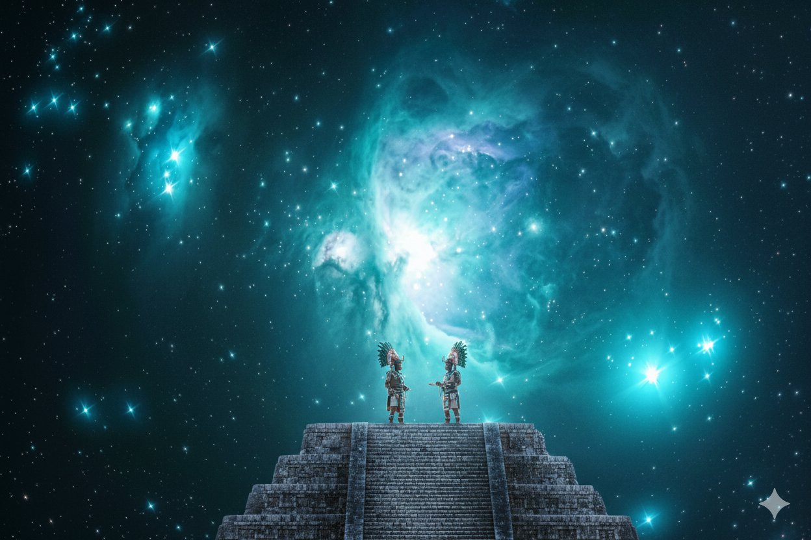

Photo series combining astrophotography and imagery from the same time period

[Whirlpool](../Images/Whirlpool.md)

[Andromeda](../Images/Andromeda.md)

[Eagle v2](../Images/Eagle%20v2.md)

[Orion](../Images/Orion.md)

[Horsehead and flame nebulas](../Images/Horsehead%20and%20flame%20nebulas.md)

[California nebula](../Images/California%20nebula.md)

.jpg)
[California nebula](../Images/California%20nebula%20(1).md)

